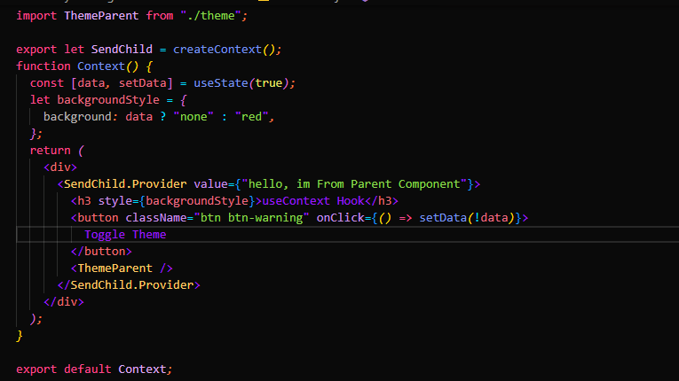

# Function and Class Components

### Function Component

- Function components are created using function.
- It is also know as simple component.

### Function Syntax

```sh
export default function IncreAndDecreFunction() {
  const [Count, setcount] = useState(0);

  let Increment = () => {
    setcount(Count + 1);
  };
  let Decrement = () => {
    setcount(Count - 1);
  };

  return (
    <div>
      <h1>{Count}</h1>
      <button onClick={Increment}>+</button>
      <button onClick={Decrement}>-</button>
    </div>
  );
}
```

### Class Components

- Class components are created using class, a class components also have extends and component in it,

- Extends and component are react class components
- Without extends and component a class component wont be work in react but in javaScript.

### Class Syntax

```sh
class IncreAndDecreClass extends React.Component {
  state = {
    count: 1,
  };

  //   incrementing
  Increment = () => {
    this.setState({ count: this.state.count + 1 });
  };

  //   decrementing
  Decrement = () => {
    this.setState({ count: this.state.count - 1 });
  };

  render() {
    return (
      <div>
        <h1>{this.state.count}</h1>
        <button onClick={this.Increment}> + </button>
        <button onClick={this.Decrement}> - </button>
      </div>
    );
  }
}
export default IncreAndDecreClass;
```

**Function and Class Component End**

# Creation of Layout

### Main objective is to create a dynamical Layout

- It plays a important role in a home page as it is created using React Library.
- As i click the button, the content that connected to the button will be displayed.
- Without changing any other content except the required one.

**Creation of Layout End**

# Modularising Component

### Objective of Mdularising

- It is used when we need a Component in multiple places
- When you need a Similar content like buttons, paragraphs, components, you can use this.
- It can also be modified using creating certain Props.

### It can be Created like this

````sh
import React from "react";

function Buttons({
  border = "1px solid red",
  backColor = "yellow",
  btnText = "Submit",
  btnClass = "btn btn-success",
  onBtnClick,
}) {
  return (
    <button
      className={btnClass}
      onClick={onBtnClick}
    >
      {btnText}
    </button>
  );
}

export default Buttons;```

### And Modularise like this
```sh
    <Buttons/>
````

- This single Tag is enough to create a Button component if the method done like this.

**Modularising Component End**

# LifeCycle Method

### Objective of LifeCycle

- Each and Every components in React has a life cycle, and it has three phases they are;

```sh
1.Mounting
2.Updating
3.unMounting

```

## Class Component LifeCycle

**_Codes_**

- Img-1
  

- Img-2
  

### Mounting

### it has 3 phases, they are:

- Constructors()
- componentWillMount()
- ComponentDidMount()

**_Constructors()_**

- No matter how many methods are there, constructor will be called first.

**_CoponentWillMount()_**

- The Component Will be called on initiation.
- it will be called only once for first time it called.

**_ComponentDidMount()_**

- It will be render after function or method started initiating.
- it will be called only for first time.

**_Like This_**


## Updating

### It has four phases, they are:

- ComponentWillUpdate()
- ComponentDidUpdate()
- render()
- ShouldComponentUpdate()

**_ComponentWillUpdatte()_**

- it asks perminsion to grant next phase to be executed.
- if the executed component comes true, next phase will be started or executed again.

**_ComponentDidUpdate()_**

- When ComponentWillUpdate cleared,it will be executed.

**_Render()_**

- It is actually the output of DOM or HTML.
- one of the main phase in Class Component and, it is used default to render values.

**_ShouldComponentUpdate()_**

- It is a Simple and efficient to be handled.
- when a user set this to false, a phase to be executed next will be stopped.
- if true, the next phase will be executed as normal.

**_Like This_**


## UnMounting

**_ComponentWillUnmount()_**

- It is executed right before the component is about to removed or deleted.
- e.g: 1.we can set an alert or prompt to ComponentWillUnmount that will executed before a component vanish.
- 2.When the prompt if removed, the content will be deleted.

**_Like This_**


**_Class Components End_**

# Functional component

- As same as class components functional component also have same phases like mounting, updating, unmounting.
- but unlike class component we can use useEffect in functional component for lifeCycle method.

**_Code_**


```sh
useEffect(() => {
      console.log("The Component Initiated");
     return () => {
        console.log("The Component UnMounted");
      };
    }, [mount]);
```

**_Mounting_**


- with useEffect we can invoke the mounting phase, updating phase and unmounting phase.

**_Unmounting_**


**_Functional Components End_**

### LifeCycle Method End

# React Hooks

## There are several hooks are used to memoize a function or data, they are:

- useCallback
- useDiffferedValue
- useMemo
- useReducer
- useRef
- useTransiton

### useCallback()

- It allow us to isolate data. it means it allows to access data only when it called without rendering all the time.
- it will not automatically return on every render.
- it applies a delay
- only runs when one of its dependencies runs or updates.
- its main objective to prevent components from rerendering before its props got changed.
- it returns memoized function.

**_Code_**

```sh
useCallback(() => {

}, []);
```

### UseMemo()

- It returns a memoized value, that is internally calculated value.
- its objective is same as callback that memoize as caching a value.
- So that we dont need to recalculate.
- only runs when one of its dependencies update, and it returns memoized values.

**_Code_**

```sh
let doubleNmbr = useMemo(() => {
   return SlowFun(value1);
   }, [value1]);
```

### UseDefferedValue()

- it fixes when the component render slower than normal.
- it resolves slowness by implementing a delay before some information is calculated.
- The values will be calculated after the important state update have finished runing.
- our function can only run after the important state updates finished running, so that the other non important
  components may run after priority completed.
- it enhances the performance of the Components and functions.

**_Code_**

```sh
  const deffered = useDeferredValue(value1);
```

### UseRef()

- Allows to persist values on rerender.
- it can used to create a value that doesn't change therir value.
- it has current object as default value.
- to get initiated we must use{useRef.current}.

```sh
const count = {current: 0}
```

- its the default object value.

**_Code_**

```sh
import React, { useEffect, useRef, useState } from "react";

function UseRef() {
  const [word, setWord] = useState("");
  const renderCount = useRef(0);

  useEffect(() => {
    renderCount.current = renderCount.current + 1;
  });

  return (
    <div>
      <input
        onChange={(eve) => {
          setWord(eve.target.value);
        }}
      />
      <h4>Enter Here {word}</h4>
      <h5>I rendered {renderCount.current} times</h5>
    </div>
  );
}
```

### useTransition()

- It is used when we need a component to be executed in a priority basis.
- whe we need a component that should not be meant to be a priority one, we can call useTransition to that component.
- After asiginng UseTransition to the component the component will be executed after high priority component executed.
- with this we can avoid components rendering at the same time and lagging.

  **_Code_**

```sh
const[ispending, startTransition] = useTransition()
```

## Hooks-2

- useEffect
- useContext
- createContext

### UseEffect Hook

- it used to do an additional thing while rendering components, this additional things also known as side Effects.
- it can have two arguments, one as props and other one as dependency array.
- without the dependency array the useEffect runs everytime a component render or update.
- use dependency array to make a component run only on first rendering.
- it is altered version of component cycle for function component.

**_Code_**

```sh
useEffect(() => {
      console.log("The Component Initiated");
     return () => {
        console.log("The Component UnMounted");
      };
    }, [mount]);
```

### useContext

- it is used specially to avoid props drilling in big projects or API.
- it is used as replacement for redux to solve within react itself.
- to give or get component from parrent to nthChild ther is three steps to follow:

**_CreateContext_**
**_Creating Provider_**
**_useContext_**

### CreateContext



- to create a Context first import CreateContext and do like follow,

```sh
let CreatingContext = createContext()
```

### Creating Provider

- to Create a Context Provider do as follow,
  

```sh
<creatingContext.provider value={'hey! im the Value to be passed'}>
<App/>
<Child/>
<creatingContext.provider/>
```

- creating context provider and insert the components.
- after creating provider, need to insert components where we need to use the property value
- now you can import creatingContext in any of this two component, App and Child Component ready to uss CreattingContext.

### useContext


- if we want to use Child component to use as importing creatingContext, do as follow
- first import it to Child Component

```sh
import React, {useContext} from react;
```

- then create useContext with a variable
- now pass the Context Provider as props in useContext

```sh
let ContextVar = useContext(CreatingContext)
```

- and place the Context variabel as output property
  

**_Hooks-2 End_**

# Router & Navig`ation

- to start using router and navigation first have to install react router dom.
- to use router first have to create BrowserRouter in the main component, where we can access every component we need.

**_Syntax_**

```sh
<BrowserRouter>
<App/>
</BrowserRouter>
```

**_Code_**


- next need to import react-router-dom with two params to the App file to create the navigation access.

**_Code_**

```sh
import { Routes, Route } from "react-router-dom";
```

```sh
  <Routes>
        <Route path={"/"} element={<Navigation />} />
        <Route path={"/navinext"} element={<NavigationNext />} />
        <Route path={"/Jeev"} element={<NavigationLast />}></Route>
      </Routes>
```

- as you see above we can access to any page using Routes and route
- all you need to do is set path and element attributes to assign a path to launch and which page should render.

### UseNavigate

- it is the most important thing to navigate page to page.
- to start using useNavigate first import it to the page you want to navigate from.

```sh
import { useNavigate, Link } from "react-router-dom";
let navigate = useNavigate();
```

- next need to create a prop along with useNavigation to set onclick event to where to navigate.
- after importing useNav use second prop to link a button, and set it to the corresponding links.

**_(Or)_**

- we can create a function and use the function name wherever we want.
- creating function name also useful when you need to do a function and move to the required at a same time.
- it is possible. example, if a user need to login and clicked submit button, the backend have to verify the user and also take him to the homepage, two process will happen at the same time of clicking a single button or link.

```sh
const navi = () => {
navigate("/navinext")
}
```

**_and_**

```sh
<button onclick={navi}>nextPage<button>
```

**_(or)_**

- use Link from import and set 'to' attribute to set navigation path to create a simple navigation link like follow,

  

```sh
<Link to={'/navinext'}>
<button>nextPage<button>
</Link>
```

**_Routing & Navigation End_**

# Environment Setup .env

**_.env file and its specifications_**

- its main purpose is to maintain the secuirity keys and some confidential stuffs of the deverloper or the website.
- it is used to keed the developer informations, passwords, confidential keys etc.
- it doesn't need any import to show.
- it is displayed using (process.env.VariableName).
- when pushing or uploading this to a stream like github or bitbucket the .env file wil be ignored by the developer to keep it safe.
- to ensure the safety of dev, a file is created name called .gitIgnore and set the .env info in it.
- when pushing, the main stream websites would automatically ignores .env, because it is placed in .gitIgnore file.
- so that the crutial informations maintained safely

**_Environment Setup End_**
